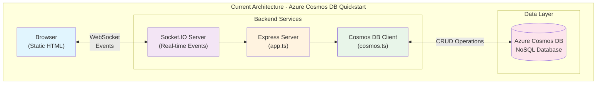
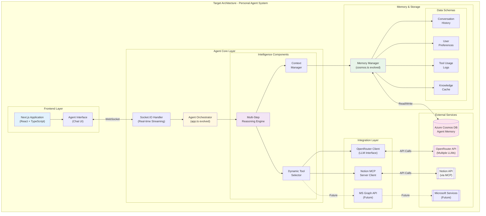
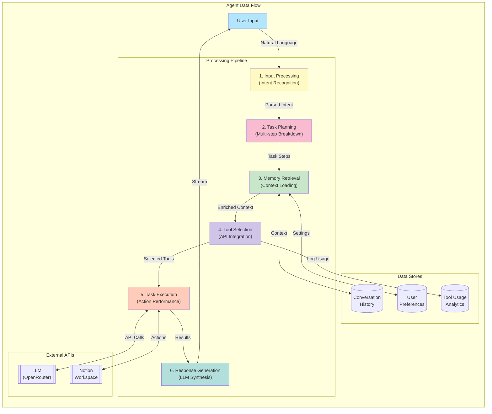
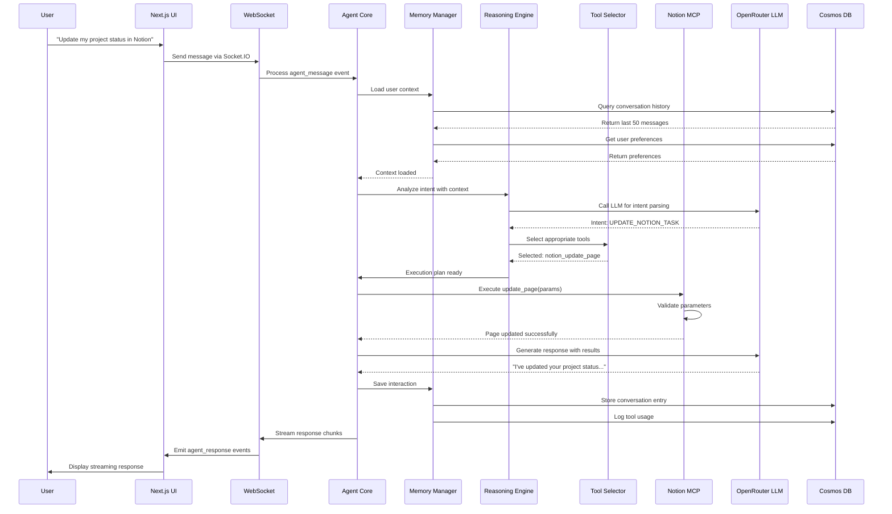

# Product Requirements Document: Personal Agent
## Built on Azure Cosmos DB Foundation

---

## Executive Summary

This Product Requirements Document (PRD) outlines the transformation of the current Azure Cosmos DB TypeScript quickstart application into a sophisticated **Personal Agent** system. The project leverages the existing real-time communication infrastructure (Socket.IO) and Cosmos DB integration as a foundation for building an intelligent workplace assistant designed to enhance productivity and enable strategic focus for its primary user, Christian.

**Current State**: A functional Azure Cosmos DB web application with real-time capabilities  
**Target State**: An AI-powered Personal Agent with memory management, tool integration, and autonomous task execution  
**Development Timeline**: 12 weeks (3 phases)  
**Initial Stack**: TypeScript, Express.js, Socket.IO, Azure Cosmos DB, OpenRouter (LLM), Notion MCP Server

---

## 1. Project Overview

### 1.1 Vision Statement
Transform the existing Azure Cosmos DB quickstart into an intelligent Personal Agent that acts as a force multiplier for workplace efficiency, enabling users to focus on strategic direction rather than operational management.

### 1.2 Current Repository Analysis

**Repository**: `personal-agent-cosmosdb`  
**Current Components**:
- **Backend**: Express.js server with Socket.IO for real-time communication
- **Database**: Azure Cosmos DB client with basic CRUD operations
- **Frontend**: Static HTML with Socket.IO client
- **Architecture**: Event-driven with real-time messaging capabilities

**Key Files to Evolve**:
- `app.ts`: Main server file → Agent orchestration hub
- `cosmos.ts`: Database client → Memory management system
- `static/`: Basic UI → Agent conversation interface

### 1.3 Strategic Advantages of Current Foundation
1. **Real-time Infrastructure**: Socket.IO provides instant agent-user communication
2. **Cosmos DB Integration**: Already configured for flexible document storage
3. **TypeScript**: Type safety for complex agent logic
4. **Modular Structure**: Easy to extend with new capabilities

---

## 2. Technical Architecture Evolution

The following architecture diagrams provide multiple perspectives on the system design, showing the current state, target state, data flow patterns, interaction sequences, and the transformation journey. These visualizations help stakeholders understand both the technical implementation and the incremental development approach.

### 2.1 Current Architecture



### 2.2 Target Architecture



### 2.3 Data Flow Architecture



### 2.4 Interaction Sequence



### 2.5 Transformation Journey

```mermaid
graph TD
    subgraph "Transformation Journey"
        subgraph "Phase 1: Foundation (Weeks 1-4)"
            Current["Current State:<br/>Basic Cosmos DB App"]
            Step1["Add Agent Core Module"]
            Step2["Extend Cosmos DB Client<br/>for Memory Patterns"]
            Step3["Integrate OpenRouter<br/>for LLM Access"]
            Step4["Add Notion MCP<br/>Integration"]
            
            Current --> Step1
            Step1 --> Step2
            Step2 --> Step3
            Step3 --> Step4
        end
        
        subgraph "Phase 2: Intelligence (Weeks 5-8)"
            Step5["Implement Reasoning<br/>Engine"]
            Step6["Build Tool Registry<br/>& Selector"]
            Step7["Add Context<br/>Management"]
            Step8["Create Multi-step<br/>Task Planning"]
            
            Step4 --> Step5
            Step5 --> Step6
            Step6 --> Step7
            Step7 --> Step8
        end
        
        subgraph "Phase 3: Advanced (Weeks 9-12)"
            Step9["Background Task<br/>Execution"]
            Step10["Proactive Intelligence<br/>Features"]
            Step11["Performance<br/>Optimization"]
            Step12["Production-Ready<br/>Agent"]
            
            Step8 --> Step9
            Step9 --> Step10
            Step10 --> Step11
            Step11 --> Step12
        end
        
        subgraph "Future State"
            Future["Azure AI Foundry<br/>Migration"]
            Enterprise["Enterprise<br/>Deployment"]
            
            Step12 --> Future
            Future --> Enterprise
        end
    end
    
    style Current fill:#ffcdd2
    style Step4 fill:#c8e6c9
    style Step8 fill:#bbdefb
    style Step12 fill:#d1c4e9
    style Enterprise fill:#fff9c4
```



### 2.6 Component Transformation Plan

#### Phase 1: Foundation (Weeks 1-4)
1. **Extend `cosmos.ts`** for agent memory patterns:
   ```typescript
   // Memory schema additions
   interface AgentMemory {
     conversationHistory: ConversationEntry[]
     userPreferences: UserPreference[]
     toolUsageLog: ToolUsage[]
     knowledgeCache: KnowledgeItem[]
   }
   ```

2. **Transform `app.ts`** into agent orchestrator:
   - Add OpenRouter integration endpoint
   - Implement agent message processing pipeline
   - Maintain Socket.IO for real-time responses

3. **Integrate Notion MCP Server**:
   - Add as new Express route handler
   - Implement secure authentication
   - Create tool registry for agent access

#### Phase 2: Intelligence Layer (Weeks 5-8)
1. **LLM Integration via OpenRouter**
2. **Multi-step reasoning engine**
3. **Tool selection and execution framework**
4. **Context management system**

#### Phase 3: Advanced Features (Weeks 9-12)
1. **Autonomous task execution**
2. **Proactive intelligence**
3. **Advanced memory patterns**
4. **Performance optimization**

---

## 3. Detailed Implementation Roadmap

### 3.1 Week 1-2: Core Infrastructure Setup

**Objective**: Establish agent foundation while maintaining existing functionality

**Tasks**:
1. **Refactor Database Layer** (`cosmos.ts`):
   ```typescript
   export class AgentDataClient extends DataClient {
     async saveConversation(entry: ConversationEntry): Promise<void>
     async getUserPreferences(userId: string): Promise<UserPreference>
     async logToolUsage(usage: ToolUsage): Promise<void>
     async searchMemory(query: string): Promise<MemorySearchResult[]>
   }
   ```

2. **Create Agent Core Module**:
   ```typescript
   // agent/core.ts
   export class PersonalAgent {
     constructor(
       private llmClient: OpenRouterClient,
       private memory: AgentDataClient,
       private tools: ToolRegistry
     ) {}
     
     async processMessage(input: UserInput): Promise<AgentResponse>
     async executeTask(task: Task): Promise<TaskResult>
   }
   ```

3. **Implement OpenRouter Client**:
   ```typescript
   // integrations/openrouter.ts
   export class OpenRouterClient {
     async chat(messages: Message[]): Promise<string>
     async streamChat(messages: Message[]): AsyncGenerator<string>
   }
   ```

### 3.2 Week 3-4: Notion Integration & Basic Tools

**Objective**: Enable agent to interact with Notion workspace

**Tasks**:
1. **Notion MCP Server Integration**:
   ```typescript
   // integrations/notion-mcp.ts
   export class NotionMCPClient {
     async updatePage(pageId: string, content: any): Promise<void>
     async queryDatabase(databaseId: string, filter: any): Promise<any[]>
     async createPage(parentId: string, properties: any): Promise<string>
   }
   ```

2. **Tool Registry Implementation**:
   ```typescript
   // agent/tools.ts
   export interface Tool {
     name: string
     description: string
     parameters: ParameterSchema
     execute: (params: any) => Promise<any>
   }
   
   export class ToolRegistry {
     register(tool: Tool): void
     getTools(): Tool[]
     executeTool(name: string, params: any): Promise<any>
   }
   ```

3. **Memory Management Patterns**:
   - Conversation history with sliding window
   - User preference learning
   - Tool usage analytics

### 3.3 Week 5-8: Intelligence Enhancement

**Objective**: Implement sophisticated reasoning and task orchestration

**Key Features**:
1. **Multi-step Task Planning**
2. **Context-Aware Responses**
3. **Proactive Suggestions**
4. **Error Recovery & Retry Logic**

### 3.4 Week 9-12: Advanced Automation

**Objective**: Enable autonomous operations and advanced integrations

**Key Features**:
1. **Background Task Execution**
2. **Scheduled Intelligence Reports**
3. **Pattern Recognition & Automation Suggestions**
4. **Performance Optimization**

---

## 4. Technical Specifications

### 4.1 Development Environment
- **IDE**: Cursor (with AI assistance)
- **Runtime**: Node.js 18+
- **Package Manager**: npm
- **Version Control**: Git (GitHub)

### 4.2 Core Dependencies
```json
{
  "dependencies": {
    "@azure/cosmos": "^4",
    "@notionhq/client": "^2",
    "openai": "^4",
    "express": "^4",
    "socket.io": "^4",
    "zod": "^3",
    "langchain": "^0.1"
  },
  "devDependencies": {
    "@types/node": "^20",
    "typescript": "^5",
    "tsx": "^4",
    "vitest": "^1"
  }
}
```

### 4.3 Environment Configuration
```env
# Azure Cosmos DB
COSMOS_ENDPOINT=<your-endpoint>
COSMOS_KEY=<your-key>
COSMOS_DATABASE=PersonalAgentDB
COSMOS_CONTAINER=AgentMemory

# OpenRouter
OPENROUTER_API_KEY=<your-key>
OPENROUTER_MODEL=anthropic/claude-3-opus

# Notion
NOTION_API_KEY=<your-key>
NOTION_MCP_SERVER_URL=<mcp-server-url>

# Agent Configuration
AGENT_USER_ID=christian
AGENT_MAX_MEMORY_ITEMS=1000
AGENT_CONVERSATION_WINDOW=50
```

### 4.4 Security Considerations
1. **API Key Management**: Use environment variables, never commit keys
2. **Authentication**: Implement user session management
3. **Data Encryption**: Encrypt sensitive data in Cosmos DB
4. **Rate Limiting**: Implement for all external API calls
5. **Input Validation**: Sanitize all user inputs

---

## 5. Migration Strategy

### 5.1 Phase 1: Local Development (Current)
- Run entirely in Cursor environment
- Use `.env` for configuration
- Test with personal Notion workspace

### 5.2 Phase 2: Containerization
- Dockerize the application
- Use Docker Compose for local services
- Prepare for cloud deployment

### 5.3 Phase 3: Azure Deployment (Future)
- Migrate to Azure App Service
- Transition to Azure AI Foundry when available
- Implement Azure Key Vault for secrets

---

## 6. Success Metrics

### 6.1 Technical Metrics
- **Response Time**: < 2 seconds for simple queries
- **Memory Retrieval**: < 500ms for context lookup
- **Tool Execution**: < 5 seconds for Notion operations
- **Uptime**: 99.9% availability

### 6.2 User Experience Metrics
- **Task Automation Rate**: 70% of routine tasks automated
- **Accuracy**: 95% correct task execution
- **User Satisfaction**: Measured via feedback
- **Time Saved**: 2+ hours per day

### 6.3 System Health Metrics
- **API Usage**: Monitor OpenRouter token consumption
- **Database Performance**: Query execution times
- **Error Rate**: < 1% failed operations
- **Memory Efficiency**: Optimal storage utilization

---

## 7. Development Guidelines

### 7.1 Code Standards
- **TypeScript**: Strict mode enabled
- **Linting**: ESLint with recommended rules
- **Testing**: Unit tests for all agent tools
- **Documentation**: JSDoc for all public APIs

### 7.2 Git Workflow
- **Main Branch**: Protected, production-ready
- **Feature Branches**: `feature/agent-<feature-name>`
- **Commit Convention**: Conventional Commits
- **PR Reviews**: Required before merge

### 7.3 Testing Strategy
1. **Unit Tests**: Individual agent tools
2. **Integration Tests**: End-to-end workflows
3. **Memory Tests**: Database operations
4. **Load Tests**: Concurrent user scenarios

---

## 8. Risk Mitigation

### 8.1 Technical Risks
- **LLM Costs**: Implement token limits and caching
- **API Rate Limits**: Queue and retry mechanisms
- **Data Loss**: Regular Cosmos DB backups
- **Performance**: Implement caching layers

### 8.2 Security Risks
- **Data Privacy**: Encrypt sensitive information
- **API Exposure**: Implement proper authentication
- **Injection Attacks**: Input validation
- **Session Hijacking**: Secure token management

---

## 9. Future Enhancements

### 9.1 Short Term (Post-MVP)
- Voice interface integration
- Mobile app companion
- Browser extension
- Slack/Teams integration

### 9.2 Long Term (6+ months)
- Migration to Azure AI Foundry
- Microsoft Graph integration
- Multi-user support
- Custom model fine-tuning
- Enterprise deployment options

---

## 10. Conclusion

This PRD outlines the transformation of a simple Azure Cosmos DB quickstart into a sophisticated Personal Agent system. By leveraging the existing real-time infrastructure and database integration, we can rapidly develop a powerful AI assistant that delivers immediate value while maintaining a clear path to enterprise-scale deployment.

The phased approach ensures continuous delivery of value while building toward the ultimate vision of an intelligent workplace companion that enables users to focus on strategic direction rather than operational tasks.

**Next Steps**:
1. Set up development environment in Cursor
2. Configure Azure Cosmos DB with agent schemas
3. Implement basic agent message handling
4. Begin Notion MCP integration
5. Start iterative development following the weekly roadmap

---

## Appendix A: Code Examples

### A.1 Agent Message Handler
```typescript
// Extending current Socket.IO handler
io.on('connection', (socket) => {
  const agent = new PersonalAgent(/* dependencies */);
  
  socket.on('agent_message', async (message) => {
    const response = await agent.processMessage({
      text: message.text,
      userId: message.userId,
      context: message.context
    });
    
    // Stream response back to user
    for await (const chunk of response.stream()) {
      socket.emit('agent_response', { chunk });
    }
  });
});
```

### A.2 Memory Storage Pattern
```typescript
// Cosmos DB document structure
interface ConversationDocument {
  id: string
  partitionKey: string // userId
  type: 'conversation'
  timestamp: number
  messages: Message[]
  metadata: {
    model: string
    tokensUsed: number
    tools: string[]
  }
}
```

### A.3 Tool Definition Example
```typescript
const updateNotionTask: Tool = {
  name: 'update_notion_task',
  description: 'Updates a task status in Notion',
  parameters: {
    taskId: { type: 'string', required: true },
    status: { type: 'string', enum: ['todo', 'in-progress', 'done'] }
  },
  execute: async (params) => {
    const client = new NotionMCPClient();
    return await client.updatePage(params.taskId, {
      properties: { Status: params.status }
    });
  }
};
``` 